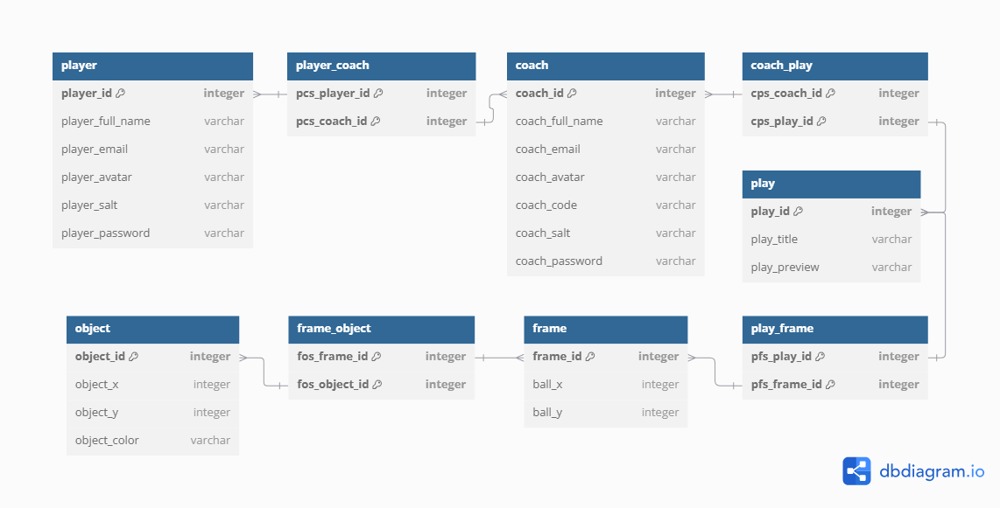

# Team Project: Milestone 2

## Field of Dreams

## Progress Report

### Completed Features

- Login/Logout Functionality
- Player/Coach Registeration Functionality
- Player/Coach information displayed in settings
- Player's Coaches displayed on the addcoach page
- Preview Plays Functionality
- Displaying User Plays on the myplays page

### Pending Features

- Player Adding a new Coach
- Change Password Functionality
- Delete Account Functionality
- Creating/Editing an animation
- ...

### Page Implementation Progress

<!-- Provide links to wireframes of pages not 100% completed -->

| Page                   | Status | Wireframe                               |
| ---------------------- | ------ | --------------------------------------- |
| Home                   | ✅     |
| Sign Up (Coach)        | ✅     |
| Sign Up (Player)       | ✅     |
| My Plays (Coach)       | ✅     |
| My Plays (Player)      | ✅     |
| User Settings (Coach)  | ✅     |
| User Settings (Player) | ✅     |
| View Animation         | 90%    | [wireframe](../Proposal/playerview.png) |
| Edit Animation         | 0%     | [wireframe](../Proposal/coachview.png)  |

## API Documentation

| Method   | Route                      | Description                                                  |
| -------- | -------------------------- | ------------------------------------------------------------ |
| `POST`   | `/users/login`             | Receives an email and password                               |
| `POST`   | `/users/logout`            | Log out the current user                                     |
| `GET`    | `/users/current`           | Get current user logged in                                   |
| `POST`   | `/players`                 | Creates a new Player account and returns the new user object |
| `GET`    | `/players/:userId`         | Retrieves a Player by its Id                                 |
| `GET`    | `/players/:userId/plays`   | Get all plays that can be accessed by a specific Player      |
| `GET`    | `/players/:userId/coaches` | Get all Coaches a specific Player is linked to               |
| `PUT`    | `/players/:userId`         | Updates a Player by its Id                                   |
| `DELETE` | `/players/:userId`         | Delete a specific Player                                     |
| `POST`   | `/coaches`                 | Creates a new Coach account and returns the new user object  |
| `GET`    | `/coaches/:userId`         | Retrieves a Coach by its Id                                  |
| `GET`    | `/coaches/:userId/plays`   | Get all plays that are created by a specific Coach           |
| `PUT`    | `/coaches/:userId`         | Updates a Coach by its Id                                    |
| `DELETE` | `/coaches/:userId`         | Delete a specific Coach                                      |
| `POST`   | `/plays`                   | Creates a new play and returns the new user object           |
| `GET`    | `/plays/:playId`           | Retrieves a play by its Id                                   |
| `PUT`    | `/plays/:playId`           | Updates a play by its Id                                     |
| `DELETE` | `/plays/:playId`           | Delete a specific play                                       |

## Database ER Diagram

## Team Member Contributions

#### Bree Cobb

- Created animation.html, animation.css, animation.js
- Researched and implemented Motion One for animation
- Created createAnimation.html in preparation for final milestone
- Updated compose.yml and related routing files to match Milestone 2 expected structure

#### Carter Fultz

- Database Construction
- Updated APIRoutes
- Create Player, Coach, Play, Frame, and Object models
- ...

#### Isaac Palmer

- Authentication
- Updated API Routes
- Updated frontend data population and html

#### Milestone Effort Contribution

<!-- Must add to 100% -->

| Bree Cobb | Carter Fultz | Isaac Palmer |
| ------------- | ------------- | ------------- |
| 33%            | 33%            | 33%            |
