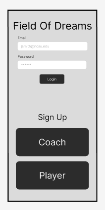
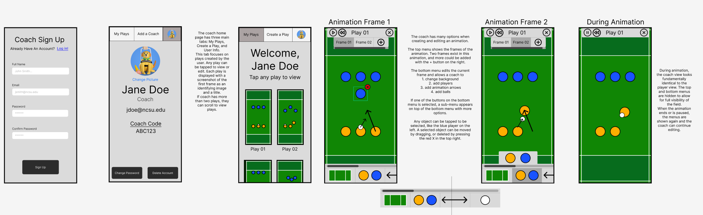
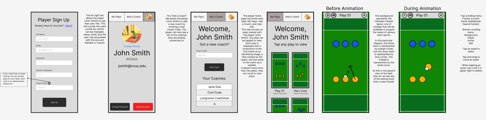
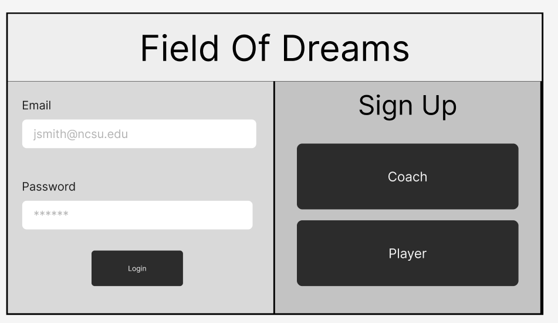
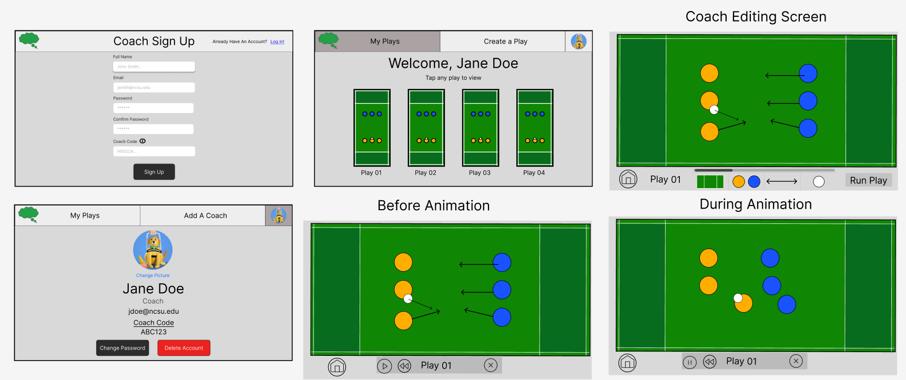
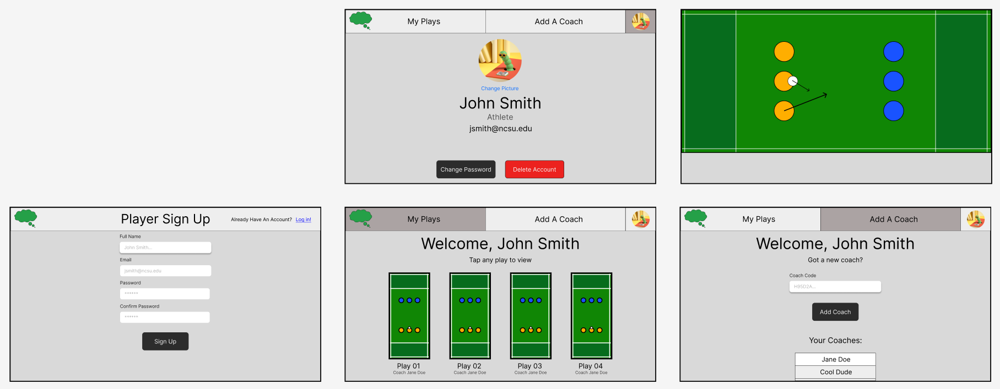

# [Field of Dreams]

## Problem Statement
It can be tough for coaches and athletes to visualize a play or explain complicated strategies and movements around the field, particularly during high pressure situations. Currently, most coaching works through verbal explanation and physical demonstration, but this is impractical outside of practices and can lead to miscommunications of the ideas. This PWA is designed for teams to create and display different strategies and visualize it with smooth animations. This would allow coaches and players to be more involved as a team by providing a coach with a visual representation of their ideas and strategies. This content can be shared with players so they can view it on their own time outside of practice or while the coach is occupied. The target audience for this application is coaches and players of a variety of team sports who are looking to create resources for their team to use.
## Feature Description
The application will begin by providing the user with a register/login page where they may make an account to access the application with. The application has two different user roles: Coach and Athlete.

For an athlete to sign up, the user must enter their email, name, and password as well as a Coach Code that will link the athlete to the plays created by a coach. After the athlete signs up and logs in, they will see a homepage that will include navigation at the top of the page where they can view their profile, plays, or add a new coach. In the “My Plays” tab, the athlete can see a list of plays and the coach who created them. In the “Add A Coach” tab, the athlete has the ability to enter additional Coach Codes to be added to the mailing list of different coaches. An athlete will not be able to edit plays; they will only be able to view and simulate the plays.

For a coach to sign up, the user must enter their email, name, and password. After logging in, the coach will see a homepage that will include a header where they can view their profile and a list of plays that they have created. A coach will have the ability to create new plays, edit or simulate them, and send plays to other athletes. 

When a coach creates a new play, they will be taken to a new page and be able to see a top down view of the field in a vertical or horizontal view depending on user preference. Starting on the first frame, the coach will have a toolbar where they can add players and a ball. For each frame added, the coach may also click and drag on a player to create an arrow the player will follow when simulated. Finally the coach can click on the “simulate” button which will play out each of the frames.

Some stretch goals are listed below, which may be added to broaden the scope of the project or its features:
* Visualization features
    * Playback/time bar
        * Adding a feature where the time bar will display how far along the video is
        * Potential additional extension of the time bar being draggable to replay or accelerate the animation to specific points
    * Variable play speed
        * Being able to change the play speed of videos
    * Arrows toggle (Different types of arrows?)
        * Allowing for viewers to turn on and off view of animation arrows
        * Possible additional extension of arrows varying based on team
* Additional animation design options
    * Curved lines?
        * Adding the ability for transitions to be curved instead of straight lines
    * Changing colors of discs
        * Allowing for disc colors to be customizable
    * Selecting different types of fields
        * Allowing for field types to be customizable
    * Customizable fields (Images?)
        * Allowing for importing of images to use as fields
    * Customizable discs (Images?)
        * Allowing for importing of images to use as discs
    * Variable length of frames
        * Different frames might have different lengths based on how long they should last, might be difficult in combination with other stretch goals
* Other
    * Push plays vs players request via code
        * Allowing for coaches to push a play to a distribution list versus players requesting a specific play with a code to get it
    * Filtering plays (By coach?)
        * Allowing for players to filter their plays based on the coach/coaches that created them

### PWA Capabilities
As team-based sports are often played on a field where a coach has to be actively involved, having a diagramming tool that is accessible on both phone and desktop would greatly increase both efficiency and portability compared to a tool that is only present on one or the other. With Field Of Dreams, a coach can use their larger desktop monitor to plan out plays in a comfortable environment before the game, and then access and share those plays using a mobile device on the field without needing to draft on a smaller screen while they are busy managing the rest of the team. Since the animations would be stored in a database connected to the coach’s account, there would be no hassle with uploading or downloading files either.
	For players, making Field Of Dreams a PWA instead of a regular web app allows for greater accessibility compared to a standard website. They can review new animations as their coach creates them without being concerned about editing privileges, and from the comfort of their own homes rather than trying to learn a complex play during the game.
 
## Wireframes

### Mobile View

#### Coach View

#### Player View

### Desktop View

#### Coach View

#### Player View

## Sources of Data Needed
N/A, Field of Dreams requires no outside data to create or manage. If some of our stretch goals such as customizable fields or discs are implemented, the Sources of Data will be updated accordingly. 

## Team Member Contributions

#### [Bree Cobb]

* Wrote “PWA Capabilities” section
* Created all mobile wireframes except Sign up/User Settings screens

#### [Carter Fultz]

* Wrote “Features” section
* Created mobile Home, Sign Up, and User Settings screens
* Created desktop Home, Sign Up, User Settings, and Player Add a Coach screens

#### [Isaac Palmer]

* Wrote “Problem Statement” section
* Wrote “Stretch Goals” subsection
* Created desktop animation wireframes

#### Milestone Effort Contribution

<!-- Must add to 100% -->

Bree Cobb | Carter Fultz | Isaac Palmer
------------- | ------------- | --------------
33.3%            | 33.3%            | 33.3%
